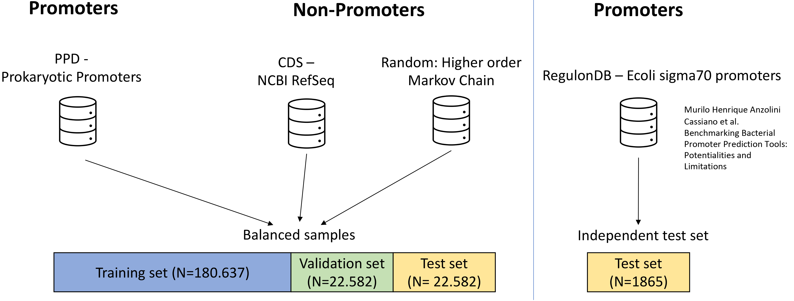
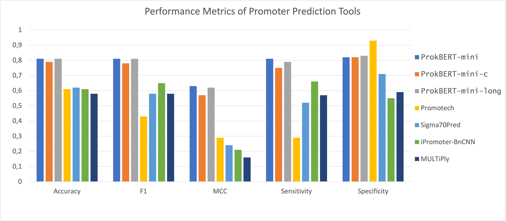
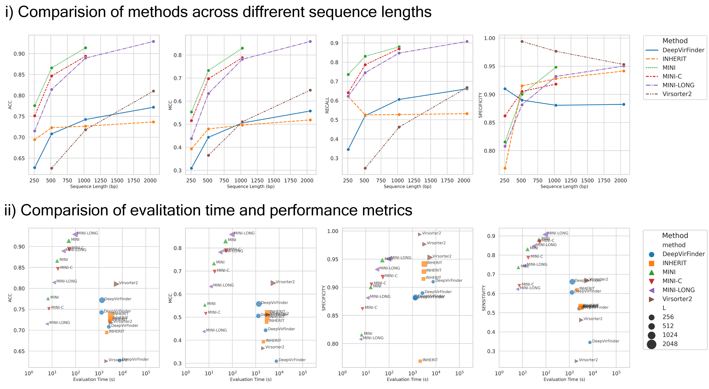

# The ProkBERT model family

ProkBERT is an advanced genomic language model specifically designed for microbiome analysis. This repository contains the ProkBERT package and utilities, as well as the LCA tokenizer and model definitions.

### Introduction
The ProkBERT model family is a transformer-based, encoder-only architecture based on [BERT](https://github.com/google-research/bert). Built on transfer learning and self-supervised methodologies, ProkBERT models capitalize on the abundant available data, demonstrating adaptability across diverse scenarios. The models’ learned representations align with established biological understanding, shedding light on phylogenetic relationships. With the novel Local Context-Aware (LCA) tokenization, the ProkBERT family overcomes the context size limitations of traditional transformer models without sacrificing performance or the information-rich local context. In bioinformatics tasks like promoter prediction and phage identification, ProkBERT models excel. For promoter predictions, the best-performing model achieved an MCC of 0.74 for E. coli and 0.62 in mixed-species contexts. In phage identification, they all consistently outperformed tools like VirSorter2 and DeepVirFinder, registering an MCC of 0.85. Compact yet powerful, the ProkBERT models are efficient, generalizable, and swift.

### Features
- Local Context-Aware (LCA) tokenization for better genomic sequence understanding.
- Pre-trained models available for immediate use and fine-tuning.
- High performance in various bioinformatics tasks.
- Facilitation of both supervised and unsupervised learning.

### Applications

ProkBERT has been validated in several key genomic tasks, including:
- Accurate bacterial promoter prediction.
- Detailed phage sequence analysis within complex microbiome datasets.

## Getting Started

To get started with ProkBERT, clone the repository and follow the setup instructions in the documentation.

```bash
pip install prokbert
cd prokbert
```

### Quick Start
Our model is easy to use with the [transformers](https://github.com/huggingface/transformers) package.


To load the model from Hugging Face:
```python
import torch
from transformers import AutoTokenizer, AutoModel
from prokbert.prokbert_tokenizer import ProkBERTTokenizer

tokenizer = ProkBERTTokenizer(tokenization_params={'kmer' : 6, 'shift' : 1})
model = AutoModel.from_pretrained("nerualbioinfo/prokbert-mini-k6s1", trust_remote_code=True)

segment = "TATGTAACATAATGCGACCAATAATCGTAATGAATATGAGAAGTGTGATATTATAACATTTCATGACTACTGCAAGACTAA"
inputs = tokenizer(segment)['input_ids']

tokenizer.batch_encode_plus([segment])

```


### Pre-Training

Codes for pre-training are coming soon.

### Finetune

Codes for finetuning are coming soon.

## Tutorials and examples

In addition to the information on this page, you can refer to the following additional resources.

- The [ProkBERT documentation](https://prokbert.readthedocs.io/en/latest/).
- Examples in jupyter notebook.

# About ProkBERT  
## Detailed pre-training and evaluation process

### The pre-training process

ProkBERT models were pre-trained using a modified Masked Language Modeling (MLM) approach, tailored to handle the unique characteristics of genomic sequences. This involved the innovative use of overlapping and shifted k-mers for tokenization (LCA tokenization), which allowed for a richer contextual understanding of sequences. The pretraining process was conducted on a diverse dataset from the NCBI RefSeq database, ensuring comprehensive coverage of various genomic entities. This rigorous approach has equipped ProkBERT models with the capability to accurately interpret and analyze complex microbiome data.

### ProkBERT trained for promoter prediction

In the first application of ProkBERT models, we focused on differentiating bacterial promoter from non-promoter sequences. Our database, mainly derived from the Prokaryotic Promoter Database (PPD), included experimentally validated promoter sequences from 75 organisms, complemented by an independent test set of _E. coli_ sigma70 promoters. To generate a comprehensive negative dataset, we combined non-promoter sequences (CDS), sequences generated via a 3rd-order Markov chain, and purely random sequences, ensuring a diverse and challenging training environment. For fine-tuning, we adapted the Megatron BERT architecture for binary classification, employing a novel weighting mechanism to integrate representations of all tokens, rather than relying on the conventional [CLS] token. This approach, combined with a tailored softmax operation, yielded a weighted sum of sequence representations for accurate classification. Our fine-tuning process involved the AdamW optimizer, a linear learning rate scheduler with warmup, and training on NVIDIA A100-40GB GPUs for two epochs. The comprehensive training and validation process, illustrated in Figure 1, ensured that ProkBERT models could efficiently and accurately predict bacterial promoters, setting a new standard in genomic sequence analysis.


*Figure 1: Promoter dataset schematic*

Our models were evaluated in a binary classification setting, distinguishing between promoter and non-promoter sequences, and trained on a diverse set of data, including _E. coli_ sigma70 promoters. ProkBERT models demonstrated superior performance with an impressive accuracy and MCC (Matthews Correlation Coefficient) of 0.87 and 0.74 respectively, outperforming other established tools such as CNNProm and iPro70-FMWin (see Figure 2). This highlights ProkBERT's effectiveness in correctly identifying both promoters and non-promoters, with consistent results across various model variants. The evaluation also included a comparative analysis with newer tools like Promotech and iPromoter-BnCNN, where ProkBERT maintained its lead, especially in specificity and sensitivity. This robust performance is further emphasized in diverse testing scenarios, showcasing ProkBERT's generalizability and reliability in promoter prediction tasks across different bacterial species. The success of ProkBERT in this domain underscores its potential as a powerful tool in genomic sequence analysis, particularly in accurately predicting bacterial promoters.



*Figure 2: Comparative analysis of ProkBERT's promoter prediction performance*

### ProkBERT in phage identification

ProkBERT was secondly tested on phage sequence analysis, highlighting its critical role in understanding bacteriophages within microbiomes. Phages are instrumental in influencing host dynamics and driving horizontal gene transfer, pivotal in the spread of antibiotic resistance and virulence genes. Grasping phage diversity is essential for addressing global challenges such as climate change and various diseases. However, quantifying and characterizing phages accurately faces obstacles due to the limited viral sequences in databases and the complexities of viral taxonomy. To address these issues, we developed a unique phage sequence database with recent genomic data, employing a balanced benchmarking approach to reduce bias in viral group categorization.

In compiling this database, we assembled an extensive collection of phage sequences from various sources, including the RefSeq database. We utilized the CD-HIT algorithm to eliminate redundancy, resulting in a dataset of 40,512 unique phage sequences. This dataset was meticulously mapped to their bacterial hosts, shedding light on phage-bacteria interactions. Special emphasis was placed on the relationships between phages and key bacterial genera like Salmonella and Escherichia, due to their significant health impacts. This balanced dataset is crucial for exploring the intricate relationships between phages and bacteria, furthering our understanding of microbial ecology.

For the phage sequence analysis, we adopted a binary classification methodology akin to the approach used for promoter training.

ProkBERT demonstrated outstanding performance in phage sequence identification, excelling in both accuracy and speed. In our comprehensive evaluation against various established methods, ProkBERT models consistently outperformed others across different sequence lengths. _ProkBERT-mini_ showed exceptional accuracy with shorter sequences, maintaining high accuracy without increased false positives or negatives. Notably, for 2kb sequences, _ProkBERT-mini-long_ achieved an impressive accuracy of 92.90% and a Matthews Correlation Coefficient (MCC) of 0.859, indicating its high reliability and precision in prediction.

ProkBERT's superiority was further highlighted in its ability to maintain high sensitivity in identifying actual phage sequences and specificity in discerning non-phage sequences. Additionally, the ProkBERT family shone in terms of evaluation speed, consistently registering times under 10 seconds for all sequence lengths, making it an invaluable tool for applications that require rapid and accurate phage sequence predictions. These results underline ProkBERT's exceptional capabilities and mark it as a leading solution in the field of genomic sequence analysis, especially in the challenging area of phage sequence classification.


*Figure 3: ProkBERT identifies phage sequences accurately and rapidly*

# Citing this work

If you use the code or data in this package, please cite:

```bibtex
@Article{ProkBERT2024,
  author  = {Ligeti, Balázs and Szepesi-Nagy, István and Bodnár, Babett and Ligeti-Nagy, Noémi and Juhász, János},
  journal = {Frontiers in Microbiology},
  title   = {{ProkBERT} family: genomic language models for microbiome applications},
  year    = {2024},
  volume  = {14},
  URL={https://www.frontiersin.org/articles/10.3389/fmicb.2023.1331233},       
	DOI={10.3389/fmicb.2023.1331233},      
	ISSN={1664-302X}
}
```
